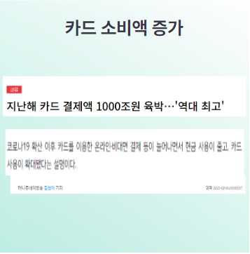
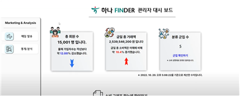
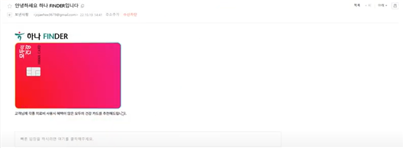

# 
<b>  마이데이터 기반 카드 추천 서비스 </b>
 
 

 

[프로젝트 홈페이지 - https://koposoftware.github.io/2022_15_jhjo/](https://koposoftware.github.io/2022_15_jhjo/)

# 
 <b>1. 프로젝트 배경 및 목적</b> 

#  <b>프로젝트 배경</b>

 

 &nbsp;마이데이터 사업이 확장하고, 빅데이터의 중요성이 대두되면서 
 데이터로 가치를 창출하는 일이 많아지고 있습니다. 코로나로 비대면 서비스가 확산하면서 현금의 사용이 크게 줄고, 카드 사용이 증가하고 있는 추세입니다. 아무 생각 없이 아무 카드나 사용하는 사람도 많지만  '특정 혜택, 할인' 들에 관심이 있는 사람들도 점차 증가하고 있습니다. 카드 추천 서비스는 우후죽순 많고 흔하지만 제가 경험해본 카드 추천 서비스는 '월 최대 ○○ 혜택' 등의 애매모호한 문장들로 추천의 정확한 근거가 전달되지 않는 경우가 많았고, 소유한 카드로 달마다 어떤 혜택을 받았는지 확인하기가 번거롭고 까다로웠습니다.
  그래서 사용자 입장에서 손쉽게 추천의 근거를 확인할 수 있으며, 혜택 확인이 보다
 쉽도록 프로젝트를 계획하게 되었습니다.  

# <b>목적</b>

## <b>[사용자]</b>

&nbsp;마이데이터 사업이 확장되고 있고 비대면 서비스가 확산함에 따라 
현금 사용은 줄어들고, 카드 사용량은 크게 증가했습니다. 카드 추천 서비스도 우후죽순 생겨나고 흔하게 볼 수 있지만, 실제 얼마나 혜택을 받았는지, 왜 이런 카드를 추천 하는지 사용자 입장에서 근거를 알기란 어렵습니다. 대부분 ‘월 최대 얼마 혜택‘ 같은 애매 모호한 문장들과 함께 혜택들을 쉽게 확인할 수 없기 때문입니다.

&nbsp;또한 사용하는 카드가 사용자에게 적합한 카드인지, 어떤 
혜택을가지고 있는지 별다른 생각을 하지 않고 쓰는 경우가 많습니다.
하지만 최근 ‘피킹률 (카드 사용금액 대비 혜택)’, ‘알뜰족’과 같은 용어들이 생겨나고, 알뜰한 소비에 관심을 갖는 사람들이 많아지고 있습니다.
 
&nbsp;본 프로젝트는 추천받은 카드를 통해 얻을 수 있는 혜택을 사용자 
입장에서 소비데이터를 기반으로 정확하고 쉽게 보여줌으로써 추천의 근거를 정확하게 사용자에게 전달하고, 적합한 카드를 추천받게 함에 있습니다.

## <b>[관리자]</b>

&nbsp;마케팅의 트랜드는 ‘메스 마케팅(소비자 전체를 대상으로 마케팅)’에서 
 ‘타겟 마케팅(특정 소비자층을 겨냥한 마케팅)’으로 변화하고 있습니다. 또한 최근 빅 데이터에 관한 관심이 커지고, 데이터의 양이 방대해지면서 데이터로부터 얻어낼 수 있는 결과물에 대한 관심도도 크게 증가했습니다.  

&nbsp;개인들의 소비데이터들을 전부 모아서 특정 ‘군집’을 형성할 수 
있다면 효과적으로 마케팅에 활용하고, 그 비용을 감소시킬 수 있습니다. 본 프로젝트에서는 소비 데이터를 기반으로 개인들을 군집화하고 그 군집의 특성을 파악해 관리자에게 전달하고 마케팅에 활용하는데에 그 목적이 있습니다.

# 
 <b>2. 프로젝트 제안서</b> 

[발표자료](/하나_FINDER_제안서.pptx) 
    

# <b>프로젝트 개요</b>

 

##  <b>데이터의 생성</b>

&nbsp;Python의 fakers 라이브러리를 이용해서 약 고객 1만 5천명의 가상의 회원 데이터
(이름, 주민등록번호, 이메일, 주소 등)을 
생성하고 회원가입 날짜 등도 난수를 이용해 랜덤하게 생성했습니다. 통계청의 KOSIS 에서 제공하는 통계 자료를 기반으로 각 회원의 연령, 성별에 따라 소비 카테고리 별로 다른 가중치를 생성하고, 그 중 일회성 지출 (미용실 ,통신비, 보험료, 학원비 등)과 지출 비용이 상대적으로 큰 부분 (골프, 주유비, 가구, 인테리어, 자동차 서비스, 의류 등)을 구분하여 그 연령대와 성별에 맞는 소비 금액 범위를 설정해 약 500만개의 데이터를 생성했습니다.  
*소비 카테고리는 서울시 빅데이터에서 제공하는 자료에 따라 대분류, 중분류, 소분류로 구분되어 있습니다. 

 

## <b>카드 정보 입력</b>
 
&nbsp;하나 카드에서 제공하는 카드 37개를 (신용카드 15종, 체크카드 16종 멀티카드 6종) 데이터베이스에 카드 이름, 카드 부연 설명, 카드 혜택, 혜택 가맹점, 연회비, 전월 실적 등을 입력해두었습니다.  데이터를 생성할 때 회원마다 카드를 1개 가진 회원과 2개를 가진 회원을 구분해 카드를 부여했습니다. 그리고 해당 카드의 CVC 번호, 카드 번호, 카드 유효기간 등을 난수를 활용해 부여했습니다. 하나 카드와 제휴된 약 90개의 가맹점들도 등록해 혜택을 계산하는데에 활용했습니다. 

 

## <b>카드의 혜택 계산</b> 

 
 

 
 
 
 
&nbsp;서브쿼리, 조인 등으로 복잡한 쿼리문들을 VIEW로 생성해 간단하게 만들고, ORACLE의 PROCEDURE와 CURSOR, FUNCTION, 임시 테이블을 활용해 카드 사용 시 혜택을 계산하도록 구현했습니다. CURSOR로 소비데이터들을 가져와 PROCEDURE 내에서 FUNCTION을 호출하고 혜택을 계산해 REF CURSOR를 통해 결과값들을 웹으로 가져와 사용했습니다. 

    

## <b>소비 데이터를 기반으로 군집 분석</b>
 
&nbsp;소비 데이터를 R을 활용해 데이터베이스에서 소비 데이터와 회원정보를 가져와 그 중 많이 소비하는 부분인 커피나 요식, 편의점, 대부분이 일회성지출에 그치는 소비 카테고리 (통신,미용 등) 는 제외한 후 CAST 함수를 활용해 행과 열을 변형시켰습니다. 전처리를 진행해 데이터를 가공하고 PCA 로 3개의 축을 사용해 약 0.78 정도의 설명력을 확보한 후에 K-MEANS CLUSTERING을 통해 군집을 형성했습니다. 

 

## 
 <b>ERD</b> 
   
   
 

   
 

[발표자료 ](/project.pptx) 

## 
 <b>사용 기술</b> 

 *  Spring-MVC 기반 웹 개발 
 *  Python을 활용한 가상의 데이터 생성 
   (Faker Libarary 사용) 
 *  R을 활용한 소비데이터 기반 군집 분석 
   (K-MEANS CLUSTERING) 
 *  WEB SOCKET과 COOL SMS를 활용한 고정 지출 알림 구현 
 *  JAVA MAIL SENDER를 활용한 카드 상품 홍보 서비스 구현 
 *  HIGH-CHART를 활용한 시각화 
 *  ORACLE PROCEDURE와 VIEW를 활용한 카드 혜택 계산 
 *  M-VIEW, INDEX를 활용한 성능 개선 
 

## 
 <b>개발 환경</b> 
 
 
 *  OS : window 10  
 *  WAS : Tomcat 9.0  
 *  JDK : java 1.8  
 *  DB : ORACLE 19C (CentOS)  
 

## 
 <b>시스템 아키텍처</b> 

# 
 <b>3.프로젝트 결과</b> 

 

  
### 
 <b><손님>
 

*   개인 맞춤 카드 추천
 
      

      

      

      

      

      

      

      

&nbsp;손님은 3개월 치 소비데이터를 기반으로 신용 카드, 체크 카드, 멀티 카드 순으로 추천을 받을 수 있습니다. 받을 수 있는 최대 혜택이 많은 순으로 신용 카드 6개, 체크 카드 6개, 멀티 카드 3개 씩 추천을 받게 됩니다. 멀티 카드는 실물 카드 하나에 여러 개의 모바일 카드를 등록해 쓰는 형태로 1~2개 조합까지 추천을 받게 됩니다. 
 
&nbsp;손님은 비슷한 연령대와 성별대의 손님들은 어떤 카드를 쓰는지 카드 
소유 현황들을 확인할 수 있고, 비슷한 소비패턴을 가진 사람들은 어떤 카드를 사용하는지 소유 현황도 확인이 가능합니다.   
또한 추천 받은 카드를 클릭하게 되면 현재 소유하고 있는 카드와 비교해 어디서 어떤 혜택을 받을 수 있는지 가맹점과 금액 등이 표시 되며 월 평균 얼마나 혜택을 받을 수 있는지 확인이 가능합니다. 그리고 해당 카드를 ‘카드 찜하기’를 통해 카드 장바구니에 등록할 수 있습니다. 

 
*  <b>카드 상품 조회</b>
 

 
 
&nbsp;고객은 카드 상품을 조회할 수 있으며, 원하는 혜택을 클릭해서 카드를 필터링 할 수 있습니다.
   
  

  
  

 
 
&nbsp;손님은 원하는 카드를 클릭하면 상세정보를 확인할 수 있습니다. 
혜택을 받을 수 있는 가맹점, 전달 실적, 연회비 타입, 연회비, 혜택율, 혜택 한도를 확인할 수 있습니다.
 
 

*   <b>혜택 조회</b>
 
      

&nbsp;회원은 가지고 있는 카드를 통해 전달에 어떤 혜택을 받았는지 금액과 혜택 받은 
가맹점들을 확인할 수 있습니다.  

*   <b>소비 레포트</b>

      

&nbsp;손님은 카드로 사용한 카드별, 금액별, 카테고리별 상세 내역을 확인할 수 있으며, 달 평균 소비금액과 소비 성향들 그래프를 통해 전달받을 수 있습니다.  

*   <b>알림 기능</b>
 

  
  

 

&nbsp;손님은 Calendar에 고정비 지출 내역들을 등록하고 알림을 제공받을 수 있습니다. Web socket을 통해서 웹에서 5일 후에 있을 지출 일정에 대한 알림을, cool SMS를 통해 1일 후에 있을 지출 일정에 대한 알림을 휴대폰 문자 메시지로 알림을 받을 수 있습니다.

 

### 
 <b><관리자>

*  <b>고객 분석 기능</b>

    
    
    

      

    

 
&nbsp;관리자는 손님들의 소비 추이, 금년도 TOP 10 카드, 군집의 특성 들을 확인할 수 
있습니다. 금년도 TOP 10 카드에서는 작년대비 카드 가입 증감 추이나 가입자 수 등을 확인할 수 있습니다. 

&nbsp;관리자는 대시 보드에서 군집 확인하기를 클릭하면 각 군집별 특성들을 확인할 수 
있습니다. 군집은 각 소비 데이터를 기반으로 형성 되었습니다.

&nbsp;우측 상단의 군집을 선택하면 각 군집들의 특징들을 확인할 수 있습니다. 군집의 
특징에는 한달 평균 사용 금액, 빈도, 금액별 소비를 어디에 많이 하는지와 어떤 카드를 많이 가지고 있는지 확인할 수 있습니다. 

 *  <b>이메일 발송</b>

 
  
  

 
&nbsp;관리자는 군집의 특성들을 확인한 후 군집의 특성에 맞는 카드를 홍보하는 이메일을 발송할 수 있습니다. 

*  <b>카드 상품 등록</b>

 
  
  

 
&nbsp;관리자는 카드 상품을 등록할 수 있습니다. 카드 정보에는 카드 이름, 카드 코멘트, 카드 이미지, 연회비, 연회비 타입 등이 입력되며 카드의 혜택에는 제휴 가맹점 약 90개를 선택해서 할인율, 혜택 한도, 한 달 실적 등을 등록할 수 있습니다.  

 

# 
 <b>4. 성능 개선</b> 

# 
 <b>5. 시연 동영상</b> 
 

  <iframe width="424" height="238" src="https://www.youtube.com/embed/reOGfxYJre0" title="YouTube video player" frameborder="0" allow="accelerometer; autoplay; clipboard-write; encrypted-media; gyroscope; picture-in-picture" allowfullscreen></iframe>

 
# 
 <b>6. 본인 소개</b> 

|이름 |조재희||
|이메일 | jaehee3679(@)daum.net|
|skill set| Frontend - HTML, CSS, Javascript|
| | Backend - Java, Spring, Oracle Database|
| |dataAnalysis - Python,R|
|자격증|2021년 사회조사분석사 2급|
| |2021년 ADSP|
| |2022년 SQLD|
|교육 사항|2022.03 ~ 2022.11 광명융합기술원 데이터분석과|
|수상|2022년 한국폴리텍대학 벤처창업아이템경진대회 본선 진출(동상확보)(중소기업벤처부)|
| |2022년 광명융합기술원 프로젝트 작품 경진대회 금상|
|특기사항|  TOEIC 830 |
| | 오목 고수, 드론 조종 자격증 보유|

